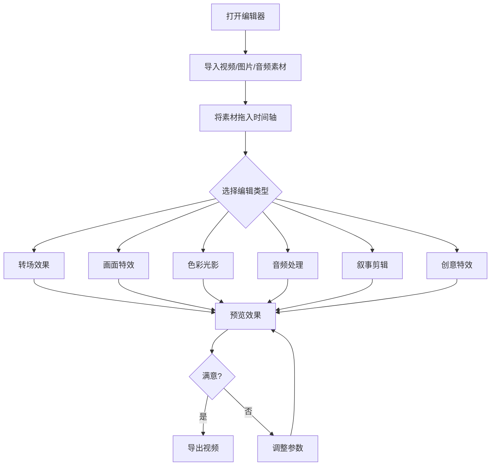

# 视频编辑器 - 产品需求文档 (PRD)

## 1. 产品概述

一款功能强大的浏览器端视频编辑器，支持丰富的转场效果、画面特效、色彩调整、音频处理和叙事剪辑功能。用户可在浏览器中完成视频片段选择、特效应用、音频处理等全流程编辑操作，无需安装任何软件。

- **目标用户**：视频创作者、内容制作人、短视频剪辑爱好者
- **核心价值**：提供专业级视频编辑能力，涵盖6大类40+种编辑效果

## 2. 核心功能

### 2.1 功能模块总览

| 模块类别 | 功能列表 |
|---------|---------|
| **转场类** | 硬切、淡入、淡出、叠化、闪白、闪黑、划像、遮罩转场、匹配剪辑、跳切、空镜转场、闪回转场 |
| **画面特效类** | 分屏、画中画、镜像翻转、旋转画面、缩放推拉、定格、倒放、抠像合成、蒙版裁切、蒙太奇拼接 |
| **色彩光影类** | 分级调色、单色化、暗角光晕、色差分离、叠加颗粒噪点 |
| **音频剪辑类** | 声画同步、声画对位、超前音、滞后音、音频淡入淡出、音效卡点、静音留白、人声混响、多音轨堆叠 |
| **叙事剪辑类** | 平行蒙太奇、交叉蒙太奇、对比蒙太奇、隐喻蒙太奇、重复剪辑、插叙、倒叙、闪回、快剪、慢剪 |
| **创意特殊类** | 故障剪辑、胶片模拟、抽帧、叠加纹理、文字卡片转场 |

### 2.2 页面功能详情

| 页面/区域 | 模块名称 | 功能描述 |
|----------|---------|---------|
| 主界面 | 预览区 | 实时预览视频效果，显示当前帧画面，支持播放/暂停控制 |
| 主界面 | 时间轴轨道 | 多轨道时间轴，支持视频/音频/效果轨道的拖拽排列与裁剪 |
| 主界面 | 素材库面板 | 导入视频/图片/音频素材，素材缩略图展示与管理 |
| 主界面 | 效果面板 | 分类展示所有效果选项，点击应用至选中片段，参数可调节 |
| 主界面 | 属性面板 | 显示当前选中元素的详细属性（时长、位置、透明度等） |

## 3. 核心流程

## 4. 用户界面设计

### 4.1 设计风格

- **主色调**：深色专业风格（#0a0a0f 深黑底色 + #00d4ff 霓虹青强调色 + #ff3366 品红辅助色）
- **按钮风格**：圆角胶囊按钮，带发光hover效果
- **字体**：JetBrains Mono（代码/数值）+ Outfit（UI文字）
- **布局风格**：三栏式专业编辑器布局（左侧素材+效果 / 中间预览 / 右侧属性）
- **图标风格**：线性图标 + 霓虹发光点缀

### 4.2 页面设计概览

| 区域 | UI元素 | 设计细节 |
|-----|--------|---------|
| 顶部工具栏 | Logo、项目名、撤销/重做、导出按钮 | 深灰背景，底部细线分隔 |
| 左侧面板 | 素材库、效果分类标签页 | 可折叠侧边栏，280px宽 |
| 中央预览区 | 视频画布、播放控制条 | 16:9比例画布，黑色背景 |
| 底部时间轴 | 多轨道时间线、播放头、缩放控制 | 波形可视化，轨道颜色区分 |
| 右侧面板 | 属性调节、关键帧编辑 | 滑块+数值输入，实时预览 |

### 4.3 响应式设计

- Desktop-first 设计，最小支持 1280px 宽度
- 侧边栏可折叠以适应较小屏幕
- 时间轴支持水平缩放和滚动

## 5. 技术约束

- 纯前端实现，使用 Canvas API 进行视频渲染和效果合成
- 使用 Web Audio API 处理音频效果
- 支持常见视频格式（MP4, WebM）导入
- 导出使用 MediaRecorder API 或 Canvas 录制
