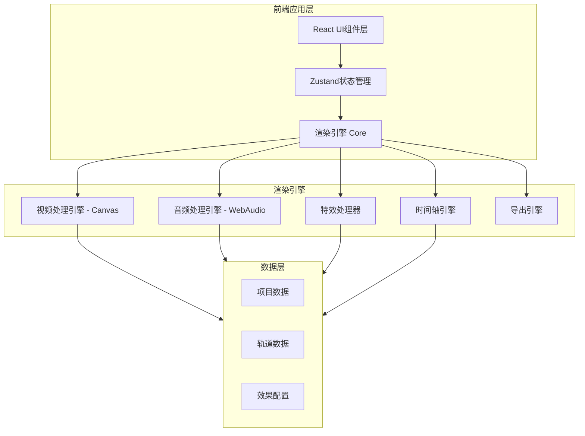

# 视频编辑器 - 技术架构文档

## 1. 架构设计



## 2. 技术选型

| 技术领域 | 选择 | 说明 |
|---------|------|------|
| 前端框架 | React 18 + TypeScript | 组件化开发，类型安全 |
| 构建工具 | Vite | 快速开发体验 |
| 样式方案 | Tailwind CSS 3 | 原子化CSS，快速迭代 |
| 状态管理 | Zustand | 轻量级状态管理 |
| 视频渲染 | HTML5 Canvas 2D API | 帧级控制，效果合成 |
| 音频处理 | Web Audio API | 音频节点图处理 |
| 图标库 | Lucide React | 统一图标风格 |

## 3. 项目结构

```
src/
├── components/           # UI组件
│   ├── PreviewCanvas/    # 视频预览画布
│   ├── Timeline/         # 时间轴组件
│   ├── EffectPanel/      # 效果面板
│   ├── PropertyPanel/    # 属性面板
│   ├── MaterialLibrary/  # 素材库
│   └── Toolbar/          # 工具栏
├── engine/               # 渲染引擎核心
│   ├── VideoRenderer.ts  # 视频渲染器
│   ├── AudioProcessor.ts # 音频处理器
│   ├── EffectComposer.ts # 特效合成器
│   ├── TransitionEngine.ts # 转场引擎
│   └── Exporter.ts       # 导出模块
├── effects/              # 特效实现
│   ├── transitions/      # 转场效果
│   ├── visual/           # 画面特效
│   ├── color/            # 色彩效果
│   ├── audio/            # 音频效果
│   ├── narrative/        # 叙事效果
│   └── creative/         # 创意效果
├── store/                # 状态管理
│   ├── useProjectStore.ts # 项目状态
│   ├── useTimelineStore.ts # 时间轴状态
│   └── useEffectStore.ts  # 效果状态
├── types/                # 类型定义
│   └── index.ts
└── utils/                # 工具函数
```

## 4. 核心数据模型

### 4.1 项目数据模型

```typescript
interface Project {
  id: string
  name: string
  duration: number
  fps: number
  resolution: { width: number; height: number }
  tracks: Track[]
}

interface Track {
  id: string
  type: 'video' | 'audio' | 'effect'
  clips: Clip[]
}

interface Clip {
  id: string
  materialId: string
  startTime: number
  duration: number
  effects: AppliedEffect[]
}
```

### 4.2 效果数据模型

```typescript
interface AppliedEffect {
  id: string
  type: EffectType
  params: Record<string, number | string | boolean>
  keyframes: Keyframe[]
}

type EffectType =
  // 转场类
  | 'hardCut' | 'fadeIn' | 'fadeOut' | 'dissolve' | 'flashWhite' | 'flashBlack'
  | 'wipe' | 'maskTransition' | 'matchCut' | 'jumpCut' | 'emptyShot' | 'flashbackTransition'
  // 画面特效类
  | 'splitScreen' | 'pictureInPicture' | 'mirrorFlip' | 'rotate' | 'zoomPan'
  | 'freezeFrame' | 'reversePlay' | 'chromaKey' | 'maskCrop' | 'montageStitch'
  // 色彩光影类
  | 'colorGrade' | 'monochrome' | 'vignette' | 'chromaticAberration' | 'grainNoise'
  // 音频剪辑类
  | 'syncAV' | 'counterpointAV' | 'advanceAudio' | 'delayAudio' | 'audioFade'
  | 'beatSync' | 'silence' | 'reverb' | 'multiTrackStack'
  // 叙事剪辑类
  | 'parallelMontage' | 'crossMontage' | 'contrastMontage' | 'metaphorMontage'
  | 'repeatEdit' | 'flashback' | 'fastCut' | 'slowCut'
  // 创意特殊类
  | 'glitch' | 'filmSimulation' | 'frameSkip' | 'textureOverlay' | 'textCardTransition'
```

## 5. 关键技术实现方案

### 5.1 视频渲染管线

```
素材解码 → 帧提取 → 效果处理链 → Canvas合成 → 输出显示
```

- 使用 `requestAnimationFrame` 驱动渲染循环
- 每个 Clip 对应一个 OffscreenCanvas 用于离屏处理
- 效果按顺序链式应用到每帧像素数据

### 5.2 转场效果实现

- 在两个相邻Clip的重叠区间内进行插值计算
- 使用 Canvas `globalAlpha` 和 `globalCompositeOperation` 实现混合
- 划像/遮罩等使用自定义 clipPath 或渐变遮罩

### 5.3 音频处理实现

- 使用 `AudioContext` 创建音频节点图
- 通过 `GainNode` 实现淡入淡出
- 使用 `DelayNode` / `ConvolverNode` 实现混响等效果
- 使用 `BiquadFilterNode` 实现EQ调节

### 5.4 导出方案

- 使用 `canvas.captureStream()` 获取视频流
- 结合 `MediaRecorder` 录制最终输出
- 支持 WebM 格式导出
